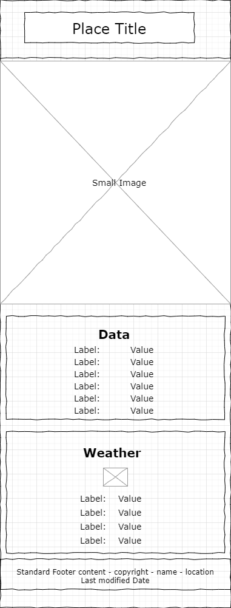
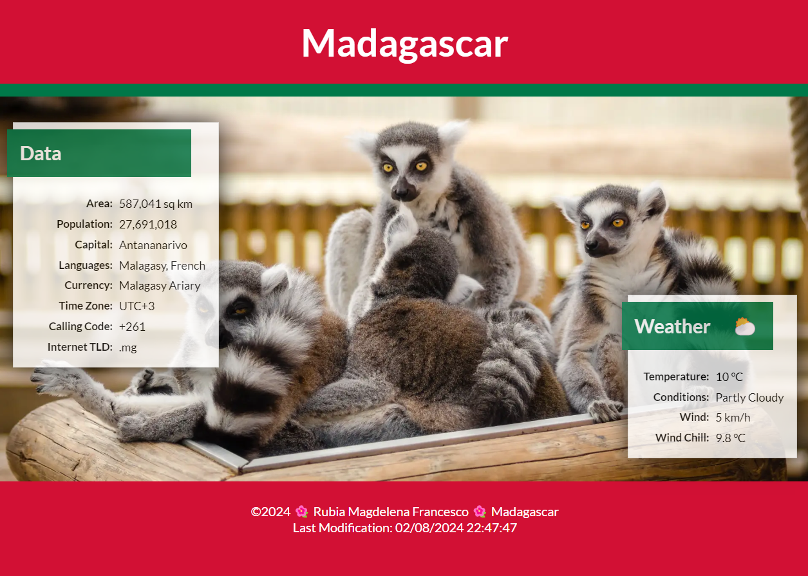
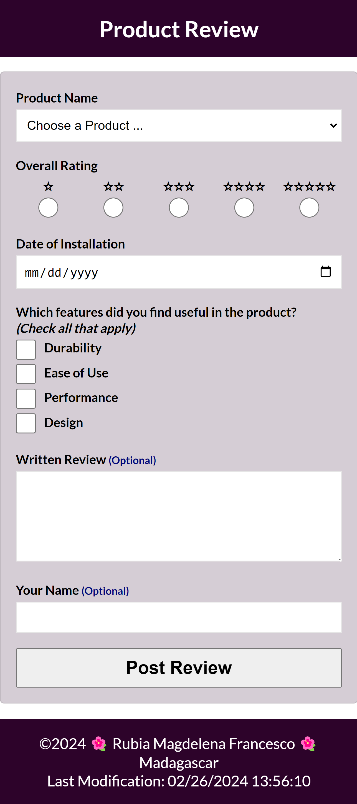

# WDD131  

The course introduces responsive design using HTML, CSS, and JavaScript with attention to usability, accessibility, and best practices in web frontend development. This two-credit course builds on prior experience in Web Fundamentals and programming. Students will learn to create dynamic websites that use JavaScript to respond to events, update content, and create responsive user experiences. 

## Versions

For each workflow a new version will be implanted.
The pattern for this repository will follow:

    - First digit: week
    - Second digit: 1 for README, 2 for release, 3 for fix
    - Third digit: number of commits

## Naming Conventions

Standard folder names for our sites/subfolders are:
- styles - Folders with this name contain CSS files.
- images - Folders with this name contain images.
- scripts - Folders with this name contain JavaScript files.

## Weeks

### Week 01
 #### Learning Activity
 - HTML and CSS Review

   This learning activity is a review of HTML and CSS layout principles, focusing on core layout design and development. Mastering the workflow process – writing code in VS Code, testing, committing, and pushing your work to your GitHub repository – is critical to your success in the course.

 - Introduction to JavaScript

   JavaScript is a popular, well-supported programming language used to create interactive and dynamic web pages, mobile apps, desktop applications and more. It is a high-level, interpreted language that is designed to run in web browsers and it can also be used on the server-side with the help of technologies like Node.js.
   
   In this class you will learn to apply your prerequisite, programming knowledge to the web using JavaScript. This language uses the same principles and common control structures as other programming languages such as Python and C#.

 - JavaScript Variables

   Variables are used to store values. These values can be primitive like a number, string, Boolean, or null or they can be objects like a function, class, or literal object. The values can be used as input to expressions, be used in processing, or be used in output to display information.

 #### Assignment
 This assignment allows you to demonstrate your prerequisite knowledge by applying HTML and CSS in the design and development of a home page. In addition, you will need to apply learning activity concepts – including JavaScript – to provide some dynamic information to the home page.

 #### Task
Design and develop the following home page as your wdd131 course landing page. Use your own content and basic styling.

---

### Week 02
 #### Learning Activity

 - CSS Media Queries

   CSS media queries let you apply different styles to your website based on the characteristics of the device being used to view your site. They allow the website to adapt to different screen sizes, orientations, and even user preferences.

 - JavaScript Constructs

   Through the prerequisite programming courses, you have built a foundational understanding of common, programming constructs, including operators, expressions, decision structures, loops, and functions. This activity focuses on a few of the common control structures in programming.

 - Document Object Model

   A key skill for any frontend web developer is the ability to manipulate DOM (DOM), a JavaScript object that is created after the browser initially renders the document. Manipulating the DOM means to read, edit, update, or delete the document, including CSS properties, dynamically. Essentially, the DOM is the outline of the HTML and content nodes.
 The purpose of this activity is to introduce the HTML DOM and to learn how to manipulate the document using JavaScript.

 - Handling DOM Events

   Handling DOM events in JavaScript is a fundamental part of building interactive web pages. In this activity, you'll learn all about the different events you can handle, how to handle them, and how to pass data between the event handler and the rest of your code.

   > "Events are things that happen in the system you are programming – the system produces (or "fires") a signal of some kind when an event occurs, and provides a mechanism by which an action can be automatically taken (that is, some code running) when the event occurs. Events are fired inside the browser window, and tend to be attached to a specific item that resides in it. " – MDN 

 - Responsive Menus

   The purpose of this activity is to build a responsive menu using JavaScript. The menu will adapt to different viewport sizes and also respond when the user clicks on a "hamburger" button (≡). In responsive design, our objective is to provide users with a positive and familiar experience.

 - JavaScript Debugging

   FDebugging is the process of finding and fixing errors in your code. This is an essential skill for any developer. You will learn how to use the browser's DevTools to debug your JavaScript code.

#### Assignment
 This assignment applies the concepts presented in the learning activities to a picture album page that is responsive in small and larger views. This page will utilize a 'hamburger' menu and respond to user requests.

#### Task
 Design, develop, test, and then deploy a temple album page using your own selections of temple pictures.

Screenshot Example in Mobile View

Screenshot Example in Larger View

---

### Week 03
 #### Learning Activity

 - Design Principles

   Good design principles are essential in web design to create a positive and engaging user experience. One goal of this course is to provide a strong foundation in effective web design. These principles should be understood, practiced, and continuously applied. Improving your skills takes practice and actively seeking constructive feedback from others.

    > "Effective web design and art are not the same. But many psychological and design principles apply to websites. You can design a great website by applying the relevant aspects of those laws to your layout, typography, and images. Design for the user and your business objectives." – Peep Laja – CXL

 - CSS Pseudo Selection

   Pseudo-classes and pseudo-elements enhance the abilities and/or content of specific selectors. A pseudo-class is used to define a special state of an element. For example, it can change the color of a button when the user hovers over it with their cursor. A pseudo-element styles specific parts of an element, such as the first letter or the first line of a paragraph.

 - Image File Formats
 
   You have worked with various image formats some of which are better suited for the web. Responsive image design aims to reduce page weights and deliver optimized for different screen sizes. This activity explores the SVG (Scalar Vector Graphic) and the WebP image formats, which offer better compression for faster page loads.

    > "_WebP_ is a modern image format that provides superior lossless and lossy compression for images on the web. Using WebP, webmasters and web developers can create smaller, richer images that make the web faster." – developers.google.com

    > The _Scalable Vector Graphic_ or _SVG_ format is a vector image format that is used for two-dimensional graphics with support for interactivity and animation. "As such, it's a text-based, open Web standard for describing images that can be rendered cleanly at any size and are designed specifically to work well with other web standards including CSS, DOM, JavaScript, and SMIL. SVG is, essentially, to graphics what HTML is to text." – MDN

 - Responsive Images

   The work of responsive image design is to support smaller page weights and to deliver content on screen size. You have worked on basic image optimization using image types, sizing, and quality level adjustments. You also need to be aware of the image's appearance on different screen sizes. This activity's objective is to reduce page weight while being conscious of image clarity and functionality on different screen sizes and viewports (the visible area of a web page).

    > "Serving desktop-sized images to mobile devices can use 2-4x more data than needed. Instead of a "one-size-fits-all" approach to images, serve different image sizes to different devices. How many image versions should you create? There is no single 'correct' answer to this question. However, it's common to serve 3-5 different sizes of an image. Serving more image sizes is better for performance, but will take up more space on your servers and require writing a tiny bit more HTML." – Web.dev

 - JavaScript Arrays

   An array is a data structure that stores a multiple values in a single variable instead of declaring separate variables for each value.

 - JavaScript Functions

   Functions in JavaScript are common programming control structures. They are blocks of code that can be called by name multiple times throughout a program to perform specific tasks. Functions can receive input data and return output data back to the caller.

    > "Functions are one of the fundamental building blocks in JavaScript. A function in JavaScript is similar to a procedure—a set of statements that performs a task or calculates a value, but for a procedure to qualify as a function, it should take some input and return an output where there is some obvious relationship between the input and the output. To use a function, you must define it somewhere in the scope from which you wish to call it. – MDN"

#### Assignment
 In this assignment, you will apply the concepts from the learning activities to the design and development of a web page. The subject of the page is a country or place where you live, have visited, or wish to visit. There are specific, functional and developmental requirements for the page's layout, design, and content.

#### Task
 Design and build a single webpage using the following wireframe as the layout and content location guide:

Wireframe design of the page in mobile view

Wireframe design of the page in a wider view

Example Page in Mobile View

Example Page in a Wider View

> You can create your own free wireframe designs using the online application [jGraph-Diagrams.net](https://app.diagrams.net/), or you can download and install the [JGraph](https://github.com/jgraph/drawio-desktop/releases) program on your computer. There are many other viable wireframe design applications, including [Moqups](https://moqups.com/). Note that you will need to create your own wireframe designs later in the course.

---

### Week 04
 #### Learning Activity

 - HTML Tables

   HTML tables provide a structured way to represent data including tabular data, which traditionally is presented in rows and columns.

   > A key design issue with table markup is that HTML tables have been misused for page layout. Do not use HTML table structures for page layout, as this creates several problems:
   > - The markup becomes bloated, which can cause confusion and make it hard to maintain and debug the page. There are better choices.
   > - Table layouts reduce accessibility for the visually impaired when used for page layout instead of their intended purpose.
   > - Tables are not ideal for responsive page behavior.

 - Lazyloading Images

   In terms of site performance and search engine optimization, your goal is to have the webpage loaded an ready for action within a few seconds of a user request. Webpages, however, often have many requests and payloads, including images, that increase the load time beyond the ideal target. The goal of this activity is to alleviate some of the load time by waiting until the page assets are actually needed by the user as they scroll. You will be introduced to the design pattern of progressive loading or 'lazy-loading' of images.

   > First Meaningful Paint
   >
   > "It's important to deliver something meaningful to the user as soon as possible — the longer they wait for the page to load, the bigger the chance they will leave before waiting for everything to finish. We should be able to show them at least the basic view of the page they want to see, with placeholders in the places more content will eventually be loaded. This could be achieved by progressive loading ─ also known as Lazy loading. This is all about deferring loading of as many resources as possible (HTML, CSS, JavaScript), and only loading those immediately that are really needed for the very first experience." ─ MDN
   
 - JavaScript Objects

   JavaScript objects are a way to group related data and functions together. Objects are a core concept in JavaScript and are used extensively in the language. In this activity, you will learn how to create and use objects in JavaScript.
   
   > "An object is a collection of related data and/or functionality. These usually consist of several variables and functions (which are called properties and methods when they are inside objects)." – MDN

 - JavaScript Array Functions

   Functional programming is a programming paradigm that treats computation as the evaluation of mathematical functions and avoids changing-state and mutable data. It is a declarative programming paradigm, which means programming is done with expressions or declarations instead of statements. Array methods that support functional programming include filter(), map(), and reduce(). There are other array methods that support functional programming, but this learning activity dives into these three common and useful methods.

  #### Assignment
  This assignment applies the concepts presented in the learning activities to enhance a previous assignment by incorporating lazy loading and by making the webpage responsive to user interaction by filtering the displayed temple data.

  #### Task
  Enhance a previous webpage assignment by adding the new required features and using provided temple data.

---

### Week 05
 #### Learning Activity
 
 - HTML Forms

  In WDD 130, you were introduced to the basic concepts of frontend form design. In this activity, you will continue the discussion and application by diving deeper into form design and development.
 
    > "The form HTML element represents a document section containing interactive controls for submitting information." – [MDN](https://developer.mozilla.org/en-US/docs/Web/HTML/Element/form)

 - JavaScript Callback Functions

  Callback functions are a powerful feature of JavaScript, widely used in the language itself and in the browser. They are used to handle events, process data, and control the program's flow.
  
    > "A callback function is a function passed into another function as an argument, which is then invoked inside the outer function to complete some kind of routine or action." – [MDN Web Docs](https://developer.mozilla.org/en-US/docs/Glossary/Callback_function)

 - JavaScript localStorage

  There are times when non-sensitive data storage would provide a better user experience and offer some site performance improvements. The Web Storage API mechanisms provide the ability to store information in a key-value format based on a particular user agent or origin. In this activity, you will discover the purpose and scope of the localStorage mechanism available through the Storage interface. You will use this knowledge to drive and display some traffic data from individual clients on a page.
  
    > The web storage data is saved in a SQLite file in a subfolder or file in the user's profile folder.

  |                | Cookies         | localStorage |	sessionStorage       |
  | :------------- | :-------------: | :----------: | -------------------- |
  | __Capacity__   | ~4KB            | ~5MB         | ~5MB                 |
  | __Expires__    | Manually set    | Never        | On tab/windows close |
  | __Accessible__ | from	Any window | Any Window   | Same tab             |
 
 #### Website Planning Document
  Planning is a critical step in the success of any project. The website plan serves as a blueprint for designing and developing your project. The purpose of this assignment is for you to organize your plans for your proposed project.
 The site plan is a living document that will change as the project progresses. It is used to communicate with the client and the development team – which in this case, is just you.

 #### Assignment
  In this assignment, you will create product review form page. You will use good form design, be given specific field requirements, and you must include a submission confirmation with a counter. In addition, the form must be user friendly on both mobile and desktop screens.

 #### Task
  Build an HTML form with a confirmation page. The form must meet the given specifications listed in the instructions. The design is up to you but must meet good form design principles. Here is an example screenshot of what you will be building.
  
  

---

### Week 06

 #### Project Overview
   The final website project is a comprehensive assessment that gives you an opportunity to demonstrate your mastery of the course learning outcomes in HTML, CSS, and JavaScript. For this project, you will create a dynamic and responsive website that adheres to development standards.

 #### Requirements

   This project will be of your own design and development. You may not consult nor work with any other individual nor group on the project. The content and subject comes from your topic proposal, and the site should be complete without any placeholders. The images and brief verbiage may be referenced from other sources, and you will need to cite these sources on a separate page. Link this reference page (which does not need to be styled) in the footer of your website.
   
   Your project must meet the following functional and developmental specifications.
   
   > These are the minimum specifications for the project. You are encouraged to go above and beyond these requirements to demonstrate your mastery of the course learning outcomes.
   
   - Your website project must be __hosted on GitHub__ and rendered via GitHub Pages.
   - The website must consist of at least __three (3) pages__ with a common navigation and theme that appeals to the target audience.
   - The site must have significant and relevant __content__ that supports the purpose of the site as outlined in your website plan.
   - The design must support __accessibility__, __usability__, __visual appeal__, and __design principles__.
   - Structure the pages with valid, standards-based __HTML__ markup.
   - Style the site with valid __CSS__ that does not contain unused and unnecessary (duplicate) declarations and rules.
   - Style the site so that it is __responsive__ to mobile (portrait and landscape) and larger screen views without violating PARC design principles.
   All images must be optimized.
   - Use a __lazy loading__ technique to support progressive design.
   - Use an __HTML form__ that meets the standards presented in the course.
   - The site must have dynamic elements powered by __Javascript__ including the following:

      ✔ Have more than one function,
      
      ✔ Include DOM interaction including selecting an element, modifying it, and listening for and reacting to events,
   
      ✔ Use conditional branching,
      
      ✔ Use objects, arrays, and array methods,
      
      ✔ Exclusively use template literals when building strings for output
      
      ✔ Use localStorage.
   
   - Ensure there are no spelling or grammatical errors.
   - Complete the project by the due date.

   > This web course intended to help you learn how to construct dynamic and responsive websites using the core web technologies of contemporary HTML, CSS, and JavaScript. Third party templates are NOT allowed. Pages built from site builder software or drag-and-drop tools or that are based on existing sites are not allowed and will lead to no credit on this project.

   ---

## Tips

   ### HTML: Hypertext Markup Language
   HTML is the standard markup language for creating web pages. It describes the structure of web pages using markup.
   
   - Official Documentation: [HTML](https://developer.mozilla.org/en-US/docs/Web/HTML) – MDN Web Docs
      - [Web Standards](https://developer.mozilla.org/en-US/curriculum/core/web-standards/)
      - [MDN Tutorials](https://developer.mozilla.org/en-US/docs/Web/Tutorials)
      - [Semantic HTML](https://developer.mozilla.org/en-US/curriculum/core/semantic-html/)
   - [HTML Reference](https://htmlreference.io/) – htmlreference.io
   - [w3c HTML 5.X Editor's Draft](http://w3c.github.io/html/sections.html) – w3c

   ### CSS: Cascading Style Sheets
   CSS is a stylesheet language that describes the presentation of an HTML document. It is used to style web pages written in HTML and XHTML.
   
   - Official Documentation: [CSS MDN Web Docs](https://developer.mozilla.org/en-US/docs/Web/CSS) – MDN
   - [CSS Reference](https://cssreference.io/) – cssreference.io
   - [All the CSS Properties You Need to Know To Build a Website](https://dev.to/domagojvidovic/all-css-properties-you-need-to-know-to-build-a-website-3dbb) – dev.to
   - [10 Modern Layouts](https://youtu.be/qm0IfG1GyZU?si=pmIttcz1fPWVwXd1) (22 min) - Chrome for Developers
   - __CSS Flex__
      - [CSS Flexbox Layout Guide](https://css-tricks.com/snippets/css/a-guide-to-flexbox/)
      - [Flexbox Froggy Game](https://flexboxfroggy.com/)
   - __CSS Grid__
      - [CSS Grid Layout Guide](https://css-tricks.com/snippets/css/complete-guide-grid/)
      - [Grid Garden Game](https://cssgridgarden.com/)
      - [Align the Grid](https://gridbyexample.com/video/align-grid/) (4 min) - gridbyexample.com
      - [Align Grid Items](https://gridbyexample.com/video/align-grid-items/) (4 min) - gridbyexample.com
      - [CSS Grid Generator](https://cssgrid-generator.netlify.app/) -cssgrid-generator

   - __CodePen__
      - [Grid Auto Columns and Image Effects](https://codepen.io/BYU-Idaho/pen/raBqbbq)

   ### JavaScript
   The JavaScript programming language empowers developers to create dynamic content, handle user input, manipulate the DOM (Document Object Model), build engaging user interfaces, and more.
   
   - MDN Web Docs: [JavaScript Building Blocks](https://developer.mozilla.org/en-US/docs/Learn/JavaScript/Building_blocks) | [JavaScript Documentation](https://developer.mozilla.org/en-US/docs/Web/JavaScript)
   - [CodeCademy JavaScript Cheatsheets](https://www.codecademy.com/resources/cheatsheets/language/javascript)
   - [API Documentation](https://devdocs.io/)
   - [22 JavaScript Functions You'll Use 99% of the Time](https://dev.to/arjuncodess/18-javascript-functions-youll-use-99-of-the-time-2bl4?context=digest)
   - JSON: [Learn JSON in 10 Minutes](https://youtu.be/iiADhChRriM)
   - JavaScript Tutorials: [JavaScript.info](https://javascript.info/)
   - Online JavaScript Book: [Eloquent JavaScript](https://eloquentjavascript.net/)
   - [15 JavaScript Array Functions You Should Master as a Senior Dev](https://dev.to/dipakahirav/15-javascript-array-functions-you-should-master-as-a-senior-dev-54gg?context=digest)
   - [ES15 Features](https://dev.to/manojspace/10-must-know-javascript-es15-features-for-modern-development-59hf)
 – dev.to

   - CodePen
      - [Date Object Examples](https://codepen.io/BYU-Idaho/pen/VYZQRma)

   ### Images and Graphics
   Images and graphics can make or break a web design. They can help make your website more visually appealing, informative, and engaging.
   
   - Free Images/Photos: [Unsplash](https://unsplash.com/) | [Pexels](https://www.pexels.com/) | [Burst](https://www.shopify.com/stock-photos) | [Pixabay](https://pixabay.com/)
   - Icons: [iconfinder](https://www.iconfinder.com/) | [Font Awesome](https://fontawesome.com/v5.15/icons?d=gallery&p=2&m=free) | [Icon Icons](https://icon-icons.com/) | [Google Icons](https://fonts.google.com/icons)
   - Placeholders: [picsum.photos](https://picsum.photos/) | [dummyimage](https://dummyimage.com/) | [placeimg](https://placeimg.com/) | [13 Placeholder Sites](https://ashallendesign.co.uk/blog/13-placeholder-avatar-and-image-websites) Ash Allen Design
   - Editing: [Pixlr-x](https://pixlr.com/x/) | [Photopea](https://www.photopea.com/) | [Remove Background](https://www.remove.bg/) | [Squoosh](https://squoosh.app/) | [TinyPNG](https://tinypng.com/)

   ### Image Placeholders

   A placeholder in web design is a space that is intentionally left blank to provide a visual cue to the user that additional content will be placed there. Image placeholders are used to reserve space for images that have not been loaded yet or to provide a representation of a missing image that is still being developed or acquired.

   These example image placeholder services are free to use and do not require an account to generate an image placeholder. The basic application is to use the provided URL services to generate a random image placeholder based upon desired dimensions in pixels (width/height).
   
   - __picsum.photos__
   
      Website: [picsum.photos](https://picsum.photos/)
   
      

      Temporary Image Placeholder 200px width by 300px height
   
   - __placehold.co__

      Website: [placehold.co](https://placehold.co/)
   
      
   
      Hero Image Placeholder 900x300
   
   - __loremflickr.com__
   
      Website: [loremflickr.com](https://loremflickr.com/)
   
      
   
      Flickr Placeholder 320x240

   ### APIs
   APIs (Application Programming Interfaces) are a set of rules and protocols that allow different software applications to communicate with each other. They enable developers to access data and services from other applications and use them in their own applications.
   
   - [150+ FREE APIs](https://dev.to/hanzla-baig/150-free-apis-every-developer-needs-to-know-m9j?context=digest) – Dev.to
   - [Public APIs](https://github.com/public-apis/public-apis) - APILayer
   - [Rapid API](https://rapidapi.com/collection/cool-apis) Collection of interesting APIs
   - [mocky](https://designer.mocky.io/) – Mock up custom APIs
   - [Free APis](https://dev.to/vyan/7-free-apis-for-your-next-projects-50n3?context=digest) – dev.to – APIs for your Projects

   ### Official Standards Organizations
   These organizations are responsible for developing and maintaining the standards that govern the web.
   
   - [WHATWG community](https://whatwg.org/)
   - [W3C](https://www.w3.org/) – The World Wide Web Consortium – HTML, CSS, and accessibility
   - [ecma international](https://ecma-international.org/technical-committees/tc39/) – Javascript (ECMAScript)

   ### Tutorials
   This are selected as relevant subjects to be used as supplemental, review material of basic concepts.

   - __HTML and CSS — freeCodeCamp (🔥) Projects__
      - [Learn HTML by Building a Cat Photo Application](https://www.freecodecamp.org/learn/2022/responsive-web-design/learn-html-by-building-a-cat-photo-app/)
      - [Learn CSS by Building a Cafe Menu](https://www.freecodecamp.org/learn/2022/responsive-web-design/learn-basic-css-by-building-a-cafe-menu/)
      - [Learn CSS Colors by Building a Set of Colored Markers](https://www.freecodecamp.org/learn/2022/responsive-web-design/learn-css-colors-by-building-a-set-of-colored-markers/)
      - [Learn HTML Forms by Building a Registration Form](https://www.freecodecamp.org/learn/2022/responsive-web-design/learn-html-forms-by-building-a-registration-form/)
      - [Learn CSS Box Model by Building a Rothko Painting](https://www.freecodecamp.org/learn/2022/responsive-web-design/learn-the-css-box-model-by-building-a-rothko-painting/)
      - [Learn CSS Flexbox by Building a Photo Gallery](https://www.freecodecamp.org/learn/2022/responsive-web-design/learn-css-flexbox-by-building-a-photo-gallery/)
      - [Learn Typography by Building a Nutrition Label](https://www.freecodecamp.org/learn/2022/responsive-web-design/learn-typography-by-building-a-nutrition-label/)
      - [Learn Accessibility by Building a Quiz](https://www.freecodecamp.org/learn/2022/responsive-web-design/learn-accessibility-by-building-a-quiz/)
      - [Learn More About CSS Pseudo Selectors by Building a Balance Sheet](https://www.freecodecamp.org/learn/2022/responsive-web-design/learn-more-about-css-pseudo-selectors-by-building-a-balance-sheet/)
      - [Learn Intermediate CSS by Building a Cat Painting](https://www.freecodecamp.org/learn/2022/responsive-web-design/learn-intermediate-css-by-building-a-cat-painting/)
      - [Learn CSS Variables by Building a City Skyline](https://www.freecodecamp.org/learn/2022/responsive-web-design/learn-css-variables-by-building-a-city-skyline/)
      - [Learn CSS Grid by Building a Magazine](https://www.freecodecamp.org/learn/2022/responsive-web-design/learn-css-grid-by-building-a-magazine/)
      - [Learn CSS Animation by Building a Ferris Wheel](https://www.freecodecamp.org/learn/2022/responsive-web-design/learn-css-animation-by-building-a-ferris-wheel/)
      - [Learn CSS Transforms by Building a Penguin](https://www.freecodecamp.org/learn/2022/responsive-web-design/learn-css-transforms-by-building-a-penguin)
   - __JavaScript — freeCodeCamp (🔥)__
      - [Basic JavaScript](https://www.freecodecamp.org/learn/javascript-algorithms-and-data-structures/#basic-javascript)